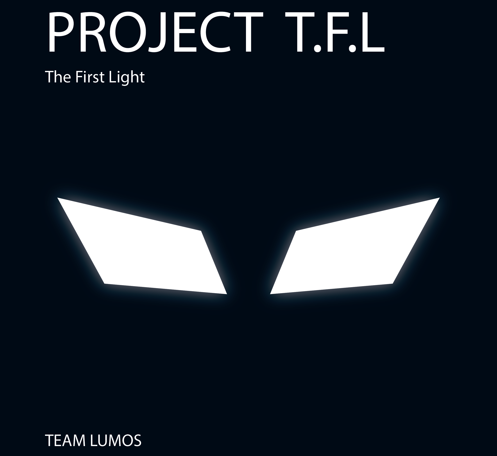

# Project-The-First-Light

Project is still in it's development stage. Project is being done by a group of five Undergraduates of University of Moratuwa.

---

## Content

* ### Spatial Sound System Development

In this section we are experimenting, how we can retrieve the spatial sounds in a virtual world using a stero sound output. We are using `Unity` game development platform for experiments. You can run simulation by yourself.

#### Dependencies

* [`Unity`](https://unity3d.com/get-unity/download) 2021.1.12f1 or higher version
* [`Visual Studio 2019`](https://visualstudio.microsoft.com/downloads/?ranMID=46131&ranEAID=a1LgFw09t88&ranSiteID=a1LgFw09t88-aDMGrjLFAVkUttxQ5pYnBA&epi=a1LgFw09t88-aDMGrjLFAVkUttxQ5pYnBA&irgwc=1&OCID=AID2200057_aff_7806_1243925&tduid=%28ir__yrmagxm2zkkfqj03kk0sohzz2n2xrobk06cknoqo00%29%287806%29%281243925%29%28a1LgFw09t88-aDMGrjLFAVkUttxQ5pYnBA%29%28%29&irclickid=_yrmagxm2zkkfqj03kk0sohzz2n2xrobk06cknoqo00) or higher version

#### How to simulate

* Clone the repository,
* Open the file `/spatial-sound-system-development/Assets/testfield.unity` in Unity,
* Run the simulation,
* You can use mouse and keyboard to move around the virtual world,
* You also can edit the `C#` script and experiment.

---

## Team : Team Lumos

* #### Team Lead
  * [Oshan Jayawardena](https://github.com/OshanJayawardana)

* #### Team Members

  * [Dilmi Caldera](https://github.com/DilmiCaldera)
  * [Nisal Jayamuni](https://github.com/NisalJayamuni)
  * [Hasya Hansanganie](https://github.com/HasyaHansanganie)
  * [Chamath Shamal](https://github.com/CSham31)
